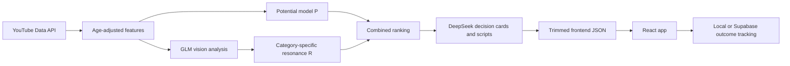

# LinkVerse

> Put a product in. Get a ranked list of creators who fit the brand and may be about to break out.

LinkVerse is a working creator-discovery demo for influencer marketing. It collects real YouTube
channel data, estimates creator potential, measures product fit in a category-specific semantic
space, and turns the result into an outreach kit. The current build supports action cameras,
sunscreen, and sports supplements.

- **Live app (Vercel):** https://web-flame-two-76.vercel.app
- **Static build (GitHub Pages):** https://chenyvhang.github.io/linkverse/

The Vercel deployment runs the DeepSeek-backed onboarding API. Every build also includes three
stage-safe scripted demos—action camera, sunscreen, and protein powder—that use real product
vectors without calling an LLM.

## What a user can do

1. Play one of three scripted product demos, or describe a custom company and product in the onboarding chat.
2. Demo presets enter real rankings immediately. Custom requests use DeepSeek and end at the
   blurred Premium preview in the current public demo.
3. Review a creator ranking based on breakout potential **P** and product resonance **R**.
4. Filter by market, subscriber band, vertical, competitor risk, or priority.
5. Open a creator's evidence and outreach kit, including the model rationale, contribution chart,
   risk warning, price range, thumbnails, and generated script.
6. Track what happened after outreach through `tracked -> contacted -> replied -> signed/declined`.

The shortlist and tracking pipeline work in `localStorage` without an account. When Supabase is
configured, tracking data syncs to an authenticated account and is isolated per user with Row Level
Security.

## Quick start: run the frontend

You do **not** need API keys or the Python pipeline to explore the app. The repository includes the
trimmed JSON datasets used by the frontend.

Requirements: Node.js 22 and npm.

```bash
git clone https://github.com/ChenYvhang/linkverse.git
cd linkverse/web
npm ci
npm run dev
```

Open http://localhost:5173/.

Under plain Vite development, the serverless onboarding endpoint is unavailable. The three demo
presets still play their scripted conversations and re-score creators immediately. A free-text
request shows the high-traffic fallback and points the visitor back to those stable demos.

To run the real free-text onboarding chat locally, put `DEEPSEEK_API_KEY` in `web/.env.local` and
run the project with the Vercel development server:

```bash
cd web
vercel dev
```

## Current data

The shipped frontend datasets were inspected on 2026-08-12:

| Category | Collected channels | Creators with decision cards | Products | Top-20 model hit rate | Baseline | Lift |
|---|---:|---:|---:|---:|---:|---:|
| Action cameras | 2,083 | 351 | 4 | 55% | 10% | 5.5x |
| Sunscreen | 1,444 | 319 | 3 | 40% | 15% | 2.7x |
| Supplements | 1,536 | 227 | 3 | 50% | 10% | 5.0x |

These are not claims of causal marketing impact. The backtest asks whether the ranking surfaces
channels that later accelerate, not whether contacting them causes sales. Action cameras currently
have two usable collection snapshots and therefore show **Live Potential**, which reports real
subscriber movement between runs. Sunscreen and supplements each have one usable snapshot, so the
UI says that live movement is not available yet.

## How it works



### Scores

- **Potential P** estimates whether a channel may be about to accelerate. It uses a dual-head
  LightGBM design: a ranking head for ordering candidates and a regression head with Platt
  calibration for probability-like output. Subscriber count and total views are excluded from the
  historical feature window because they would leak future growth.
- **Resonance R** measures how well a creator's vision vector fits a product vector. Each category
  has its own eight-dimensional semantic space; sunscreen is not scored on action-camera concepts
  such as stabilization demand.
- **Combined C** is the geometric mean of P and R.

Each demo preset uses a checked-in product vector on its category's axes, then re-ranks creators
with centered cosine similarity. For a custom free-text request, DeepSeek gathers the company,
product, and desired creator style and classifies the category. The current public demo then shows
a blurred Premium ($7/month) preview rather than exposing the custom ranking. A failed API call
shows a plain high-traffic message instead of an error or a fabricated result.

### Pipeline stages

| Stage | Module | Output |
|---|---|---|
| 1. Collect | `pipeline.collect` | Raw YouTube channel and video snapshots |
| 2. Features | `pipeline.features` | Age-adjusted velocity, cadence, engagement, and momentum features |
| 3. Vision | `pipeline.vision` | Category-specific content vectors and visual evidence |
| 4. Score | `pipeline.score` | Potential, resonance, calibration, conformal intervals, and backtests |
| 5. Decide | `pipeline.decide` | Product recommendation, reasoning, pricing range, and risk review |
| 5b-5d. Generate | `pipeline.scripts`, `pipeline.translate_*` | Bilingual scripts and translations |
| 6. Build | `pipeline.build` | Full `data/<category>/dataset.json` |
| Frontend export | `web/scripts/build-linkverse.mjs` | Trimmed `web/public/linkverse*.json` |

Every stage writes an inspectable artifact or cache. Failed external requests are logged and
skipped; the pipeline does not fill gaps with synthetic values.

## How we used AI

"We built this with AI" is too vague to be useful. LinkVerse used AI in two distinct ways.

### AI inside the product

- **GLM-4.6V-Flash** analyzes thumbnails and returns a category-specific content vector plus visual
  evidence.
- **DeepSeek V4 Flash** generates decision cards, outreach scripts, and English translations. It
  also powers custom Vercel onboarding conversations; the three public demo presets do not call it.
- LightGBM and cosine similarity, not an LLM, produce the creator ranking.

### AI during development

Claude Code was the primary coding assistant. It helped draft Python and React code, perform
repository-wide refactors, trace call chains, investigate failed runs, and prepare documentation.
Codex was later used to audit the current implementation against this README and rewrite the setup
instructions. The team reviewed source, outputs, plots, and builds before keeping changes.

### What AI got wrong

Several failures changed the project rather than being hidden:

- An early scoring version used current subscriber and total-view counts inside a historical
  prediction setup. That leaked information from after the prediction point and inflated the
  result. We removed the features and accepted the lower score.
- Isotonic calibration passed numerical checks but collapsed most creators onto a few probability
  levels, visible as vertical stripes in the scatter plot. We traced the implementation and small
  calibration sample, then replaced it with Platt scaling.
- The first free-text multi-category matcher sent only the currently loaded category's axes to the
  model. A sunscreen product could therefore receive a same-length but meaningless action-camera
  vector. The current API sends every category's axes and validates the vector against the category
  selected in the same response.
- A frontend version displayed the first twelve creators in dataset order as "Top picks" rather
  than sorting by combined score. Source review against real data caught the mistake.
- LLM output sometimes contained malformed field names or untranslated Chinese. The pipeline now
  normalizes known fields, validates output, retries where appropriate, and leaves missing content
  visibly missing.

### What the team wrote and decided

The team owned the product definition and the decisions that make the system defensible: the three
categories, seed vocabularies, eight-dimensional semantic spaces, hand-defined product vectors,
evaluation protocol, human intervention points, and the rule that missing coverage and unfavorable
metrics remain visible. We chose the interpretable GBDT plus cosine approach because the project
does not have genuine supervised creator-product outcome labels for a neural matcher. We also wrote
the collaboration rules and reviewed AI-generated code before accepting it. AI accelerated
implementation; it did not choose what evidence the team was willing to defend.

## Rebuilding the data pipeline

This section is optional. A fresh clone can run the frontend without it.

The full datasets, raw snapshots, model artifacts, and caches are intentionally gitignored because
they are large and may contain paid-API outputs. Rebuilding from scratch requires Python 3.13,
external API keys, YouTube quota, and time for rate-limited model calls.

Create the environment from the repository root:

```bash
python -m venv .venv

# Windows PowerShell
.venv\Scripts\Activate.ps1

# macOS/Linux
source .venv/bin/activate

pip install -r pipeline/requirements.txt
cp .env.example .env
```

Fill the required keys in `.env`, then run one category in stages. Start with small limits before
spending quota or paid model calls:

```bash
python -m pipeline.collect --category sunscreen --limit-channels 20
python -m pipeline.features --category sunscreen
python -m pipeline.validate_features --category sunscreen

# First score pass creates category-independent P, which can prioritize vision work.
python -m pipeline.score --category sunscreen
python -m pipeline.vision --category sunscreen --top-n-by-potential 20 --backend zhipu

# Re-run after vision so R is available, then generate a small decision batch.
python -m pipeline.score --category sunscreen
python -m pipeline.decide --category sunscreen --limit 3
python -m pipeline.scripts --category sunscreen --top-n 20 --limit 3
python -m pipeline.translate_variants --category sunscreen --limit 3
python -m pipeline.translate_content --category sunscreen --limit 3
python -m pipeline.build --category sunscreen
python -m pipeline.export_catalog

cd web
npm run build:data -- --category sunscreen
```

`pipeline.vision` defaults to a local Ollama backend. Use `--backend zhipu` for the configured cloud
model. Do not run unbounded collection or generation until the limited pass has succeeded.

### Environment variables

Root `.env`:

| Variable | Purpose |
|---|---|
| `YOUTUBE_API_KEY` | YouTube Data API collection |
| `ZHIPU_API_KEY` | GLM vision analysis when using `--backend zhipu` |
| `DEEPSEEK_API_KEY` | Decision cards, scripts, translations, and server-side onboarding |
| `DASHSCOPE_API_KEY` | Reserved; currently unused |

Optional `web/.env.local`:

| Variable | Purpose |
|---|---|
| `DEEPSEEK_API_KEY` | Used by `vercel dev` for the onboarding serverless function |
| `VITE_SUPABASE_URL` | Public Supabase project URL |
| `VITE_SUPABASE_ANON_KEY` | Public anon key; access is restricted by database RLS |

Never put a Supabase `service_role` key in a `VITE_` variable. Vite exposes every `VITE_` value in
the browser bundle.

## Optional Supabase setup

Without Supabase, creator tracking remains local to one browser. To enable accounts and multi-device
sync:

1. Create a Supabase project.
2. Run `supabase/schema.sql` in the Supabase SQL editor.
3. Enable email authentication.
4. Put the project URL and anon key in `web/.env.local` or the deployment environment.

The schema stores one row per `(user, category, creator)` and enforces ownership with Postgres Row
Level Security. See `supabase/README.md` for the full setup and security notes.

## Verification

Frontend checks:

```bash
cd web
npm run lint
npm run build
```

Pipeline checks:

```bash
python -m pipeline.validate_features --category action_camera
python -m pipeline.validate
```

The repository currently has **no automated unit or end-to-end test suite**. The checked-in quality
gates are the pipeline validation scripts, TypeScript production build, linter, backtest reports,
and manual browser verification. Adding regression tests for ranking, tracking state, and the
onboarding API is still open work.

## Adding a product category

A category is a semantic coordinate system, not just a list of products. Add:

```text
pipeline/config/categories/<category>/
|-- dimensions.yaml
|-- products.yaml
`-- seeds.yaml
```

Then register the category in both the pipeline registry and the frontend category list, collect
and analyze category-specific creators, rebuild the full dataset, export the catalog, and generate
the trimmed frontend JSON. Product vectors must use the exact dimension order declared in
`dimensions.yaml`.

## Repository layout

```text
linkverse/
|-- pipeline/                 Python collection, analysis, scoring, generation, and validation
|-- pipeline/config/          Category registry and category-specific semantic spaces
|-- pipeline/experiments/     Read-only experiments before production integration
|-- data/                     Full generated datasets; gitignored
|-- reports/                  Backtest reports and plots
|-- supabase/                 Account-backed tracking schema and setup
|-- web/api/                  Vercel onboarding function
|-- web/public/linkverse/     Shipped catalog and per-category datasets
|-- web/src/linkverse/        React application
|-- PLAN.md                   Implementation and decision history
|-- REFACTOR_PLAN.md          Prediction and evaluation redesign history
`-- CONTRIBUTING.md           Chinese/Korean collaboration guide
```

## Known limits

- Only YouTube is connected. TikTok, Douyin, Xiaohongshu, and Bilibili are not implemented.
- Vision and decision coverage is partial; the frontend ships only creators with decision cards.
- Product vectors are hand-defined hypotheses, not learned from campaign outcomes.
- Custom free-text matching is represented by a Premium preview; payment integration is not yet implemented.
- The feedback pipeline records outreach outcomes but does not retrain the potential model yet.
- There is no real ad-spend, conversion, or ROI attribution dataset, so LinkVerse does not claim
  causal marketing impact.
- Live Potential requires at least two sufficiently separated collection snapshots.

## Contributing

See [CONTRIBUTING.md](./CONTRIBUTING.md) for the branch, commit, pull-request, and secret-handling
workflow. The guide is written in Chinese and Korean for collaborators who are new to GitHub.
