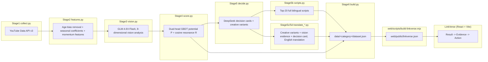

# LinkVerse

> Catch breakout creators before they blow up — find and rank YouTube creators for a brand's
> influencer marketing (demo scenario: Insta360), and hand back a ready-to-send outreach kit for
> each one.

**Live**: https://web-flame-two-76.vercel.app (full app, including the onboarding chat's real matching — that
needs the Vercel serverless function, so it's not on GitHub Pages)
**Also on GitHub Pages**: https://chenyvhang.github.io/linkverse/ (static host — chat falls back to manual
category selection, and the tracking pipeline works but is local-only there since Supabase env vars aren't
set for that build)

A GitHub Pages workflow also exists (`.github/workflows/deploy-web.yml`) but hasn't been verified
with this repo. Its base path is no longer hardcoded: the workflow passes the repo name to the build
as `PAGES_BASE`, so a rename can't leave it stale again (it previously still said `/glimmer-scout/`,
from before the `glimmer-scout` → `linkverse` rename).

---

## What this is

LinkVerse is an **end-to-end creator-marketing discovery system**: real YouTube data collection,
feature engineering, multimodal vision analysis, ML scoring, and LLM-generated decisions feed an
interactive frontend that ranks thousands of sports/action creators by "Potential score P ×
Resonance score R" and generates a localized outreach script for each one.

The project's core principle is **honesty over polish**: the pipeline would rather say "not
analyzed yet" than fabricate data or metrics to look better. Across the four functional layers
(data / matching / fission / feedback), any field the pipeline hasn't covered for a given channel
renders as `null` and shows "pending analysis" in the UI — never backfilled with fake data. Model
metrics that don't look good (a low AUC, a subscriber tier where lift < 1) are reported as-is
rather than tuned or swapped out to look better. See "Honesty statement" below.

The frontend itself has been rebuilt since the original 4-page build into a simpler **3-screen
flow — Result → Evidence → Action**: a headline stat up front, a P×R scatter plot with a ranked
list as evidence, and an outreach kit per creator as the next step. The original 4-page app (with
a backtest page, a system-status page, and a 7-section creator drawer) has been removed from the
working tree — it was unreachable from `main.tsx`, and existed twice over (`web/src/{App.tsx,pages,
components,lib}` plus a verbatim copy in `_original_src/`). Git history still has all of it:
`git log --diff-filter=D -- _original_src web/src/pages`.

---

## Four-layer architecture

The system is described externally as "data layer / matching layer / fission layer / feedback
layer" — internally, nothing is restructured just to fit that framing, and no layer introduces a
black-box module that isn't backed by real data.

| Layer | Implementation | How real is it |
|---|---|---|
| **Data** | Stage1 collection (YouTube Data API v3) + Stage2 feature engineering | Fully real: real API collection, age bias verified removed (bucket drift slope ≈0.000, under the 0.05 threshold) |
| **Matching** | Stage3 multimodal vision analysis (GLM-4.6V-Flash) + Stage4 dual-head GBDT potential score P + cosine resonance score R | Real, with an accepted tradeoff: no "pretrained black-box neural matcher" — at demo scale there's no real supervised product-fit label to train one on, so it uses an interpretable, backtestable GBDT + cosine similarity instead |
| **Fission** | Stage5 decision cards (localized creative variants) + Stage5b full scripts (Top-20) + Stage5c/5d English translation | Real: everything is generated/translated by DeepSeek, not template boilerplate |
| **Feedback** | Real permutation importance / cosine per-dimension contributions in the outreach kit, plus a "Your pipeline" screen where a creator moves through tracked → contacted → replied → signed/declined with a note. Local-only (`localStorage`) unless the deployment has Supabase configured, in which case it syncs to an account, isolated per user by Postgres Row Level Security — see `supabase/README.md` | `live_with_caveat`: outcome capture is real and, with Supabase, durable and multi-device. It is not yet fed back into training the potential score — the model still learns "did this channel accelerate," not "did contacting them work." Ad-spend/conversion data and ROI attribution still aren't wired up: no real conversion data at demo scale, so no fabricated causal dashboard |

---

## Product categories

A **category** is one product vertical. Each owns a *semantic space*: the dimensions vision.py
scores creators on, the product vectors score.py measures resonance against, the competitor
keywords the exclusivity rule scans for, and the seed keywords collect.py searches.

These are per-category because a dimension only means something inside its vertical. "Stabilization
demand" is a strong signal for an action camera and noise for a sunscreen; "sun exposure" is the
reverse. Since R is `cosine(content_vector, product_vector)`, both vectors have to live in the same
coordinate system — so **adding a category is not adding rows to products.yaml**. It means defining
a new set of dimensions and re-running vision analysis for that category's creators. The existing
351 action-camera vision analyses carry over to a new category not at all.

| Category | Dimensions | Status |
|---|---|---|
| `action_camera` | POV ratio, stabilization demand, motion complexity, scene extremity, gear visibility, narrative pace, scene diversity, slow-motion demand | **ready** — 351 creators analyzed |
| `sunscreen` | sun exposure, skin visibility, ingredient depth, authenticity, demo friendliness, reapplication context, audience skincare lean, narrative pace | `onboarding` — space defined, no data collected yet |
| `supplement` | training intensity, physique visibility, science rigor, nutrition focus, audience experience, authenticity, demo friendliness, narrative pace | `onboarding` — space defined, no data collected yet |

The two spaces share exactly one dimension key (`narrative_pace`) and it is deliberate that they
share no more: the same creator's vector is read differently in each space, and gets a different
ranking.

```
pipeline/config/
├── categories.yaml                 # registry: id, label, status, default
└── categories/<id>/
    ├── dimensions.yaml             # the semantic space + the vision output schema
    ├── products.yaml               # product vectors (same order as dimensions) + competitor keywords
    └── seeds.yaml                  # Stage1 seed keywords
```

Every stage takes `--category` (default `action_camera`), and every per-channel cache is keyed by
`(category, channel)` — the same creator can be a candidate in more than one category with a
different vector, decision and script in each:

```bash
python -m pipeline.collect --category sunscreen     # 18 keywords x 100 units = 1,800 quota units
python -m pipeline.vision  --category sunscreen
python -m pipeline.score   --category sunscreen
python -m pipeline.build   --category sunscreen     # -> data/sunscreen/dataset.json
cd web && npm run build:data -- --category sunscreen # -> public/linkverse/sunscreen.json
```

`python -m pipeline.export_catalog` (no `--category` — it covers every registered category in one
pass) writes `web/public/linkverse/catalog.json`: each category's product vectors and axis
definitions, read straight from `products.yaml`/`dimensions.yaml`. It has no dependency on any of
the stages above, so it can — and should — be rerun any time a category's products or dimensions
change, even before that category has been collected once. The onboarding chat's "jump straight to
a product" tags and its free-text productVector scoring both read this file (see "Onboarding chat"
under "Local development" below); it's the only thing standing between a fresh clone and a working
chat.

Note that **P (potential) is category-independent** and R (resonance) is not: potential is pure
channel dynamics — growth, momentum, seasonality — which mean the same thing whatever you are
selling. Only resonance is scored per space.

To activate an `onboarding` category once its data exists, flip its `status` in `categories.yaml`
and in `web/src/linkverse/categories.ts`. Until then the frontend shows placeholders rather than
fabricated scores, per the honesty statement below.

---

## Data flow



Every stage writes an independently inspectable intermediate file (`raw/` → `artifacts/features.json`
→ `cache/vision/` → `artifacts/scores.json` → `cache/decisions/` → `cache/scripts/` /
`cache/*_translations/` → `data/<category>/dataset.json`). Any step can be reproduced from disk without
rerunning everything upstream. `web/scripts/build-linkverse.mjs` is a separate, later addition: it
trims `dataset.json` (62MB, 2083 creators, mostly Chinese) down to `web/public/linkverse.json`
(~1.7MB, the 351 creators with a generated decision, English-only) — the only file the frontend
actually fetches at runtime.

---

## Directory structure

```
Demo/
├── pipeline/                      # Python data pipeline
│   ├── collect.py                 # Stage1 YouTube collection
│   ├── features.py                # Stage2 feature engineering (age-bias removal, seasonal coefficients)
│   ├── validate_features.py       # Age-bias gate validation
│   ├── vision.py                  # Stage3 multimodal vision analysis (GLM-4.6V-Flash)
│   ├── score.py                   # Stage4 dual-head GBDT potential P + cosine resonance R + tiered backtest
│   ├── decide.py                  # Stage5 DeepSeek decision cards (recommended product/reasoning/creative variants/risk review)
│   ├── scripts.py                 # Stage5b full bilingual scripts for the Top-20 (4 variants/creator)
│   ├── translate_variants.py      # Stage5c English translation of creative_variants for non-Top-20 creators
│   ├── translate_content.py       # Stage5d English translation of vision evidence + decision free text
│   ├── build.py                   # Stage6 merges every stage's output -> data/<category>/dataset.json
│   ├── export_catalog.py          # products.yaml + dimensions.yaml, every category -> web/public/linkverse/catalog.json
│   ├── validate.py                # REFACTOR_PLAN.md gate: age bias / seasonal leakage / GroupKFold, etc.
│   ├── adapters/
│   │   ├── platform_base.py       # PlatformAdapter abstract base (YouTube is the only implementation)
│   │   └── youtube_adapter.py
│   ├── common/
│   │   ├── config.py               # category-aware config loading, shared by every stage
│   │   ├── http.py                # shared request handling: timeouts/retries/backoff
│   │   ├── quota.py                # YouTube quota counter, hard-stops over budget
│   │   ├── logging.py
│   │   └── variants.py             # normalizes creative_variants field names (fixes LLM output typos)
│   ├── config/
│   │   ├── categories.yaml         # category registry — see "Product categories" above
│   │   └── categories/<id>/        # dimensions.yaml + products.yaml + seeds.yaml, per category
│   ├── raw/youtube/                # raw collected JSON (written per fetched_at, never overwritten)
│   ├── cache/<kind>/<category>/    # per-(category, channel_id) intermediates
│   └── artifacts/                  # features.json / scores.json / quota_log.json / validate_report.json
├── data/<category>/dataset.json     # full Stage6 output; gitignored, and deliberately NOT under
│                                    # web/public/ — nothing fetches it at runtime, so keeping it
│                                    # out of that directory keeps 60MB+ out of the deploy bundle
├── reports/                        # REFACTOR_PLAN.md backtest reports (backtest.md + charts)
├── web/                            # React + TypeScript + Vite frontend
│   ├── api/diagnose.ts             # Vercel serverless function: DeepSeek-backed onboarding chat
│   ├── scripts/build-linkverse.mjs # data/<category>/dataset.json -> the app's trimmed JSON
│   ├── public/
│   │   ├── linkverse.json          # trimmed, English-only dataset the app actually fetches
│   │   ├── linkverse/*.json        # per-category datasets (sunscreen/supplement: placeholders)
│   │   └── linkverse/catalog.json  # every category's product vectors + axes (pipeline/export_catalog.py)
│   └── src/
│       ├── main.tsx                 # entry point — renders LinkVerse directly, no router
│       ├── linkverse.css            # light "viewfinder" theme
│       └── linkverse/                # the whole app: LinkVerse.tsx / Scope.tsx / Kit.tsx / Onboarding.tsx / useData.ts / catalog.ts
├── .github/workflows/deploy-web.yml # GitHub Pages workflow (not currently enabled for this repo)
├── PLAN.md                          # original implementation plan (incl. the four-layer architecture decisions)
└── REFACTOR_PLAN.md                 # prediction-layer/backtest-methodology rework (5 recorded open decisions)
```

---

## Pipeline stages

| Stage | Script | Purpose | Key output |
|---|---|---|---|
| 1 | `collect.py` | YouTube collection: seed search → channel snapshot → uploads list → video details | `raw/youtube/*.json` |
| 2 | `features.py` + `validate_features.py` | Removes cumulative-views age bias via age bucketing; momentum features (`relative_velocity`/`momentum_acceleration`); seasonal coefficient estimation | `artifacts/features.json`, `artifacts/validate_report.json` |
| 3 | `vision.py` | GLM-4.6V-Flash multimodal analysis of thumbnails, outputs an 8-dimensional semantic vector (`content_vector`) + evidence text | `cache/vision/{channel_id}.json` |
| 4 | `score.py` | Potential score P: dual-head GBDT (`LGBMRanker` ranking head + `LGBMRegressor` probability head, Platt/sigmoid calibration + conformal interval); Resonance score R: cosine similarity between `content_vector` and each product's vector; tiered Top-K backtest | `artifacts/scores.json` |
| 5 | `decide.py` | DeepSeek-generated decision card: recommended product, reasoning, competitor risk review, price range, 2-3 localized creative variants | `cache/decisions/{channel_id}.json` |
| 5b | `scripts.py` | Full scripts for the Top-20 creators by combined score: TikTok vertical / YouTube horizontal × Chinese/English, each with hook/storyboard/voiceover/captions/CTA | `cache/scripts/{channel_id}_{product_id}_{platform}_{lang}.json` |
| 5c | `translate_variants.py` | Translates `creative_variants` for creators outside the Top-20 (who only got a lightweight decision card) | `cache/variant_translations/{channel_id}.json` |
| 5d | `translate_content.py` | Translates vision evidence (`sport_types`/`evidence`) and decision free text (`reasoning`/`localization_notes`/`risk_review.conclusion`/`price_range.basis`) — per-creator LLM output, not a fixed vocabulary, so it needs a real translation; built-in validation retries any output that still contains CJK characters | `cache/content_translations/{channel_id}.json` |
| 6 | `build.py` | Merges every cache + feature + score above into the frontend's data source | `data/<category>/dataset.json` |
| — | `validate.py` | REFACTOR_PLAN.md gate script: age-bias before/after, seasonal-leakage fix comparison, GroupKFold-vs-KFold pseudo-duplicate detection, label-tightening comparison, calibration curve/Brier/conformal coverage, tiered backtest table — any hard gate failing exits non-zero | `reports/*.md`, `reports/*.png` |

Every outbound request (YouTube / GLM / DeepSeek) goes through `pipeline/common/http.py`: timeouts
(5s connect / 30s read), exponential backoff (up to 3 retries), and inter-request rate limiting.
Entries that still fail after retries are skipped and logged to `artifacts/*_failures.json` — never
written as fabricated data.

---

## Current dataset snapshot

These numbers come from `data/action_camera/dataset.json`'s `meta` and can be refreshed anytime by
rerunning `python -m pipeline.build`:

| Metric | Value |
|---|---|
| Channels collected | 2,083 |
| Total videos | 93,172 |
| Vision analysis coverage | 351 / 2,083 (rate-limited on the free vision tier — not a defect, the UI honestly labels the rest "pending analysis") |
| Decision card coverage | 351 / 2,083 |
| Potential-score model | `dual_head_gbdt` (2,650 training rows, incl. rolling-window resampling) |
| YouTube API quota used | 9,200 / 10,000 units (within the daily budget) |

### Backtest results (`reports/backtest.md`)

| K | Baseline hit rate | Model hit rate | Lift |
|---|---|---|---|
| 10 | 0.10 | 0.70 | 7.0× |
| 20 | 0.10 | 0.55 | 5.5× |
| 50 | 0.06 | 0.28 | 4.67× |
| 100 | 0.08 | 0.18 | 2.25× |

**Tiered results are reported as-is, including the unfavorable ones**: once the "large channels
naturally win" advantage is removed, the 1K-10K subscriber tier's lift is 0.75 (**worse than the
baseline**), the 10K-50K tier is roughly even (1.0×), 50K-200K is 1.33×, 200K-1M is 2.0×, and the
1M+ tier (48 candidates, 3 positives) is too small a sample to draw a conclusion from. This is a
real finding: the model's edge on small/mid-size channels isn't consistently strong.

Calibration: Brier score = 0.0598; conformal target coverage 90% vs. actual 90.11%.

---

## Frontend

React 19 + TypeScript + Vite 8 + Tailwind CSS 4 + Recharts, English-only UI, three screens:

- **Result** — a headline stat up front ("we catch X% of tomorrow's breakout creators, Y× better
  than ranking by follower count"), backed by the tiered backtest above; a scripted product-onboarding
  chat (company/product/market/audience/tone) that ends by pointing at the fixed Insta360 demo data —
  it's a UI mockup of the eventual "describe your product → get a custom match" flow, not wired up
  to any real matching yet.
- **Evidence** — a P×R scatter plot (real thumbnails, not color-coded dots; four labeled quadrants;
  a rich hover card with thumbnail/subs/market) plus a ranked Top-12 list with per-creator
  checkboxes that roll up into a selection summary bar (combined budget estimate, market
  breakdown).
- **Action** — an outreach kit drawer per creator: a competitor-risk banner when flagged, P/R/combined
  scores, recent thumbnails, the match reasoning plus a feature-contribution chart, the recommended
  product and price band, an "what the AI saw" vision summary with a momentum-over-time chart, and
  the ready-to-send script with copy-to-clipboard and export-to-.txt.

The original 4-page app (bilingual toggle, backtest/system-status pages, drag-select candidate pool
with a budget cap, side-by-side radar comparison, keyboard shortcuts) has been deleted rather than
kept as unreachable source — recover it from git history if a feature there is worth porting.

The production bundle is split in two: the app itself (~219 kB) and a `charts` chunk (~379 kB,
Recharts + d3), which changes far less often and stays cached across normal UI edits.

---

## Working together

Full steps for collaborating (branches, commits, pull requests) are in
**[CONTRIBUTING.md](./CONTRIBUTING.md)** (bilingual, written for people new to GitHub).

---

## Local development

### Requirements

- Python 3.13 (virtualenv lives at the repo root, `.venv`)
- Node.js 22 (`web/`)

### Pipeline

Run every command from the **repo root** as a module (`python -m pipeline.xxx`), with the
virtualenv also at the root — not from inside `pipeline/` — so `pipeline.common.*`'s relative
imports resolve correctly.

```bash
python -m venv .venv && .venv/Scripts/activate   # Windows; use `source .venv/bin/activate` on Linux/Mac
pip install -r pipeline/requirements.txt
cp .env.example .env   # fill in the variables below

# run in order (or skip straight to build using the cached data already in pipeline/cache/)
python -m pipeline.collect --limit-channels 20      # small batch for validation
python -m pipeline.features
python -m pipeline.validate_features
python -m pipeline.vision --top-n-by-potential 20   # rate-limited free tier, start small
python -m pipeline.score
python -m pipeline.decide --limit 3
python -m pipeline.scripts --top-n 20
python -m pipeline.translate_variants --limit 3
python -m pipeline.translate_content --limit 3
python -m pipeline.build                             # merges everything into data/action_camera/dataset.json
python -m pipeline.export_catalog                    # -> web/public/linkverse/catalog.json (all categories)
```

### Frontend

```bash
cd web
npm install
npm run build:data   # regenerates web/public/linkverse.json from data/action_camera/dataset.json
npm run dev           # http://localhost:5173/
npm run build          # tsc -b && vite build
```

### Onboarding chat

The landing chat has two paths into the results page, both ending at the same re-scored ranking
(`web/src/linkverse/LinkVerse.tsx`'s `rescore()` — centered cosine similarity against whichever
product vector it's handed):

- **Tag a known product** — the chips above the chat input, one per product in
  `web/public/linkverse/catalog.json`. Clicking one calls `onDiagnosed()` immediately with that
  product's real, hand-defined vector (same one `score.py` uses) — no network call, no DeepSeek,
  instant.
- **Describe it in free text** — `web/src/linkverse/Onboarding.tsx` sends the whole conversation
  plus *every* category's axis definitions to `web/api/diagnose.ts`, which asks DeepSeek to
  determine the category and then place the product on that category's axes specifically (not
  whichever category the browser happens to have loaded — see the comment on
  `buildVectorInstruction` in that file for the bug this avoids). The resulting `productVector`
  drives the same `rescore()`.

Both paths need `catalog.json` to exist — regenerate it with `python -m pipeline.export_catalog`
after editing any category's `products.yaml` or `dimensions.yaml`.

---

## Environment variables (`.env`, see `.env.example`)

| Variable | Used for | Status |
|---|---|---|
| `YOUTUBE_API_KEY` | Stage1 collection (YouTube Data API v3) | required |
| `ZHIPU_API_KEY` | Stage3 vision analysis (GLM-4.6V-Flash, Zhipu) | required in cloud mode (`vision.py` also supports a local Ollama backend, where this isn't needed) |
| `DASHSCOPE_API_KEY` | reserved (Alibaba Cloud DashScope) | unused currently — a Qwen vision model was considered during planning, GLM was chosen instead |
| `DEEPSEEK_API_KEY` | all DeepSeek calls in Stage5/5b/5c/5d (decision cards, scripts, translation) **and** `web/api/diagnose.ts` (the onboarding chat's product classification) | required |

The static frontend itself needs no keys — `dataset.json`/`linkverse.json` are build-time files
with no secrets in them. The one exception is `web/api/diagnose.ts`, a Vercel serverless function
that calls DeepSeek server-side to classify what a visitor describes in the onboarding chat; it
reads `DEEPSEEK_API_KEY` from `process.env` and never exposes it to the browser. That function used
to call Gemini on a separate `GEMINI_API_KEY`; it was moved onto DeepSeek (same model the pipeline
pins, `deepseek-v4-flash`) so the project runs on one LLM vendor and one key. Locally it reads the
key from `web/.env.local` (gitignored) — the same value as the root `.env`, just where `vercel dev`
looks for it.

---

## Deployment

- **Vercel** (live): auto-deploys on every push to `main` via the GitHub integration; base path is
  `/`, the default in `web/vite.config.ts`. Set `DEEPSEEK_API_KEY` under the Vercel project's
  Settings → Environment Variables so `web/api/diagnose.ts` can reach DeepSeek — the old
  `GEMINI_API_KEY` there is now unused and can be removed. Locally, put the same key in
  `web/.env.local` (or run `vercel env pull web/.env.local`) and use `vercel dev`; plain `vite dev`
  never runs this function at all.
- **GitHub Pages**: `.github/workflows/deploy-web.yml` would trigger on a push to `main` touching
  `web/**` — not currently enabled for this repo. It builds with `PAGES_BASE=/<repo name>/` (read
  from `github.event.repository.name`), which `vite.config.ts` uses as the base path; every other
  build, local dev included, defaults to `/`.

---

## Honesty statement (a principle that runs through the whole project)

1. **No fabricated coverage**: any channel field `vision`/`decision`/`scripts` hasn't covered is
   `null`, and the UI renders "pending analysis" / "not generated yet" — never backfilled with
   templates or stale data.
2. **No hiding unfavorable metrics**: the GBDT's AUC was at one point only 0.516 (near-random) —
   recorded as-is in `PLAN.md`, and that metric was ultimately dropped from the product entirely in
   favor of Top-K hit rate / lift, which maps more directly to the actual decision being made;
   `REFACTOR_PLAN.md`'s 1K-10K subscriber-tier lift of 0.75 (worse than baseline) is likewise shown
   as-is, not tuned away.
3. **No pretending unbuilt capability exists**: TikTok/Xiaohongshu/Bilibili are marked "not yet
   connected" on the (original) system-status page rather than shipped as misleading empty
   implementation classes; the feedback layer's ROI/conversion attribution is explicitly labeled "no
   real conversion data at demo scale, not yet connected" rather than faked with a causal dashboard.
4. **Translation is real, not templated**: Chinese→English content (creative variants, vision
   evidence, decision cards) is translated and cached by a real LLM call; anything not yet
   translated shows the original text with an "English translation not yet generated" note instead
   of a live machine translation or one boilerplate line reused everywhere.
5. **A hard line on quota/cost**: `pipeline/common/quota.py` is the single counter for YouTube
   quota and raises immediately if the budget is exceeded; every paid external API call
   (DeepSeek/GLM) supports `--limit`/`--top-n` for a small validation batch first, so nothing runs
   at full volume silently.

More background and decision history is in `PLAN.md` (the original implementation plan) and
`REFACTOR_PLAN.md` (the prediction-layer/backtest-methodology rework, including how 5 open
decisions were resolved and what came of them).
